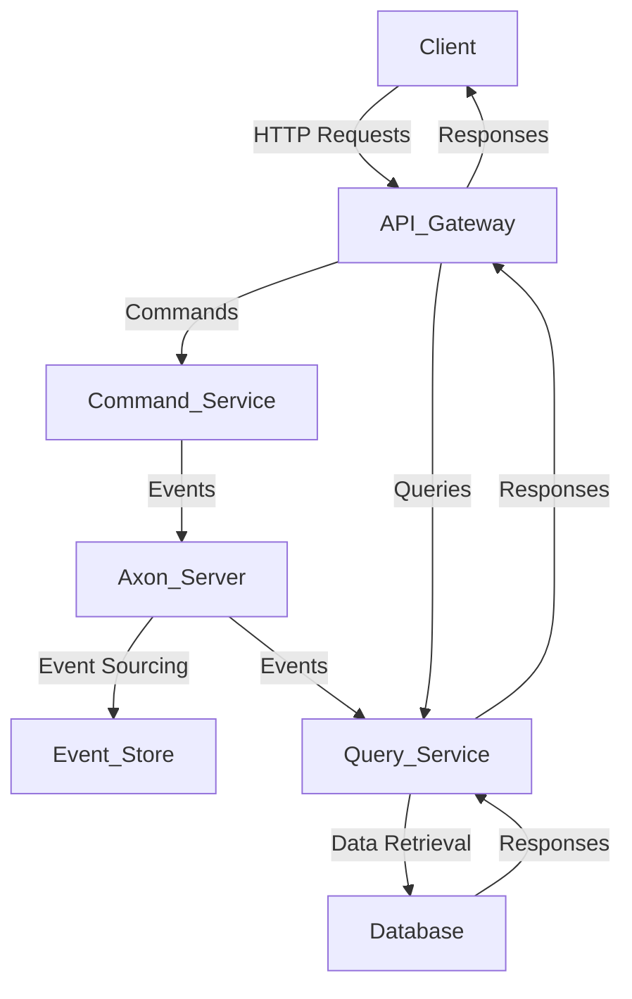

# CQRS with Axon Server - README

## Overview
Command Query Responsibility Segregation (CQRS) is an architectural pattern that separates read and write operations using different models. This project demonstrates CQRS using **Axon Server** for event-driven communication.

## Architecture Diagram



## Key Components

### **1. Command Side (Write Operations)**
- **Aggregate (`AccountAggregate.java`)**: Handles state changes and applies domain events.
- **Commands (`CreateAccountCommand.java`, `DepositMoneyCommand.java`, `WithdrawMoneyCommand.java`)**: Represent actions to modify the state.
- **Command Handler (`AccountCommandController.java`)**: Receives command requests and dispatches them via Axon.

### **2. Event Side (Event Handling & Persistence)**
- **Events (`AccountCreatedEvent.java`, `MoneyDepositedEvent.java`, `MoneyWithdrawnEvent.java`)**: Represent state changes.
- **Event Handlers (`AccountEventHandler.java`)**: Listens for events and updates the query model.

### **3. Query Side (Read Operations)**
- **Query Model (`AccountView.java`)**: Stores denormalized data for efficient querying.
- **Query Handlers (`AccountQueryController.java`)**: Handles read requests.
- **Database (`AccountViewRepository.java`)**: Stores query-side projections.

## API Endpoints

### **Command Endpoints (Write Operations)**
| Method | Endpoint | Description |
|--------|----------|-------------|
| POST   | `/accounts/create?initialBalance=1000` | Creates an account |
| POST   | `/accounts/deposit?accountId=123&amount=500` | Deposits money |
| POST   | `/accounts/withdrawn?accountId=123&amount=200` | Withdraws money |

### **Query Endpoints (Read Operations)**
| Method | Endpoint | Description |
|--------|----------|-------------|
| GET    | `/accounts` | Fetches all accounts |
| GET    | `/accounts/{id}` | Fetches account details |

## Useless Endpoints 😅

### **Endpoints That Serve No Purpose But Are Here Anyway**
| Method | Endpoint | Description |
|--------|----------|-------------|
| GET    | `/accounts/echo` | Returns `Hello, Axon!` |
| POST   | `/accounts/random` | Creates an account with a random balance |
| DELETE | `/accounts/{id}` | Pretends to delete an account but doesn't 😆 |

## Technologies Used
- **Spring Boot**
- **Axon Framework**
- **Axon Server**
- **Spring Data JPA**
- **Swagger/OpenAPI**
- **H2/PostgreSQL (for persistence)**

## Running the Project
1. **Start Axon Server:**
   ```sh
   docker run -d -p 8024:8024 -p 8124:8124 axoniq/axonserver
   ```
2. **Start the Application:**
   ```sh
   mvn spring-boot:run
   ```
3. **Test the APIs using Postman or Swagger UI.**

## Useful Links
- 🔗 [Axon Framework Documentation](https://docs.axoniq.io/)
- 🔗 [Spring Boot Documentation](https://spring.io/projects/spring-boot)
- 🔗 [CQRS Pattern Explained](https://martinfowler.com/bliki/CQRS.html)

🚀 Enjoy CQRS with Axon! Let me know if you need improvements. 😃